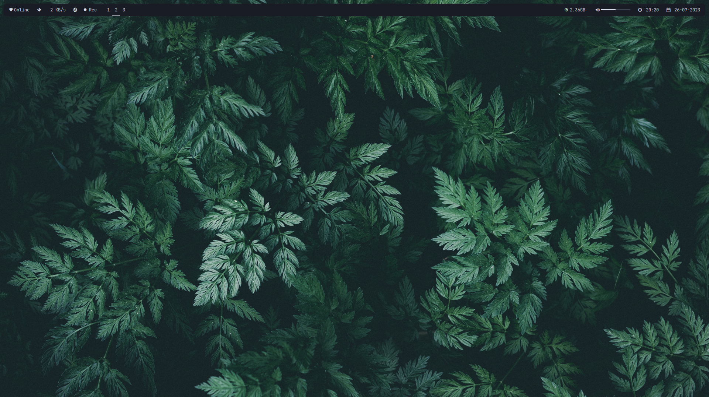
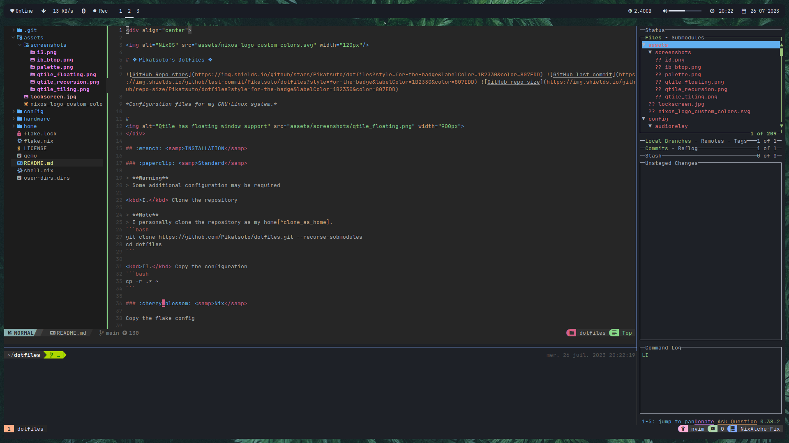

<div align="center">


# ❖ Pikatsuto's Dotfiles ❖

  

*Configuration files for my GNU+Linux system.*

#
</div>

## :wrench: <samp>INSTALLATION</samp>

### :paperclip: <samp>Standard</samp>

> **Warning**
> Some additional configuration may be required

<kbd>I.</kbd> Clone the repository

> **Note**
> I personally clone the repository as my home[^clone_as_home].
```bash
git clone https://github.com/Pikatsuto/dotfiles.git --recurse-submodules
cd dotfiles
```

<kbd>II.</kbd> Copy the configuration
```bash
cp -r .* ~
```

### :cherry_blossom: <samp>Nix</samp>

Copy the flake config

```bash
cp flake* ~
```

> Note: Don't forget to edit the appropriate settings such as username & hardware configuration
> You can use `cp /etc/nixos/hardware-configuration.nix .config/nixos/hardware-configuration.nix`

```
sudo nixos-rebuild switch --flake '.'
```

> **Warning**
> I do not use a display manager, use `startx`
> or setup your own display manager

## :bookmark_tabs: <samp>DETAILS</samp>



- Linux Kernel: [6.4.3](https://www.kernel.org/)
- Desktop Environment: [I3-WM]https://i3wm.org/
- Terminal Emulator: [Alacritty](https://github.com/alacritty/alacritty)
- Shell: [Fish](https://fishshell.com/) with [Oh my Fish](https://github.com/oh-my-fish/oh-my-fish)
- Compositor: [Picom](https://github.com/yshui/picom)
- Notifier: [dunst](https://dunst-project.org)

### <samp>Dev</samp>



- Jetbrains IDE Suite: [PyCharm](https://www.jetbrains.com/pycharm), [CLion](https://www.jetbrains.com/clion), ...
- GUI Text Editor: [Visual Studio Code](https://code.visualstudio.com/)
- TUI Commit Helper: [Lazygit](https://github.com/jesseduffield/lazygit)
- IDE: [NeoVIM](https://neovim.io/)

### <samp>Other Utilities</samp>

- TUI File manager: [Ranger](https://ranger.github.io)
- GUI File manager: [Thunar](https://docs.xfce.org/xfce/thunar/start)
- Resource monitor: [Bpytop](https://github.com/aristocratos/bpytop)
- screenshot tool: [Flameshot](https://flameshot.org)

## :art: <samp>Colors</samp>

<table align="right">
  <tr>
    <td align="center">
      <samp>
        This color scheme is OneDark
        <a href="https://github.com/joshdick/onedark.vim">OneDark</a>
      </samp>
    </td>
  </tr>
</table>


[^clone_as_home]:
    Cloning as the home directory
    <br>
    <kbd>I.</kbd> Bare Clone
    ```bash
    git clone --bare https://github.com/Pikatsuto/dotfiles.git $HOME/.git
    git --git-dir=$HOME/.git --work-tree=$HOME remote set-url origin git@github.com:Gabriel/dotfiles
    git config --local core.bare false
    ```
    <kbd>II.</kbd> Update
    ```bash
    git reset --hard HEAD
    git pull --rebase
    ```
    <kbd>III.</kbd> Submodules
    ```bash
    git submodule init
    git submodule update --init --force
    ```
    <kbd>IV.</kbd> Fix history
    ```bash
    git clone https://github.com/Pikatsuto/dotfiles.git tmp
    cp tmp/.git ~ -r
    git add .
    ```

<div align="center">
    
</div>
